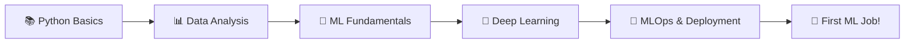

<div align="center">

<!-- Animated Header Banner -->


<!-- Typing Animation -->
<a href="https://git.io/typing-svg"></a>

<br/>

[](https://linkedin.com/in/rohit)
[](https://kaggle.com/rohit)
[](mailto:rohit@gmail.com)
[](https://github.com/rohit)


</div>

---

## 🧠 About Me

```python
class Rohit:
    def __init__(self):
        self.name        = "Rohit"
        self.location    = "India 🇮🇳"
        self.role        = ["Aspiring ML Engineer", "Data Analyst","Data Scientist"]
        self.education   = "BCA"
        self.passion     = "Turning data into decisions"
        self.fun_fact    = "I debug with print() and I'm not ashamed 😄"

    def currently(self):
        return {
            "learning"  : ["Deep Learning", "MLOps", "SQL Advanced"],
            "building"  : ["ML Projects", "EDA Notebooks", "Dashboards"],
            "goal"      : "Land my first Data/ML role in 2026 🎯"
        }

    def say_hi(self):
        print("Hey! Let's connect and build something amazing together 🚀")

me = Rohit()
me.say_hi()
```

---

## 🚀 What I'm Working On

- 🔭 Building end-to-end **Machine Learning projects** from data collection to deployment
- 🌱 Currently deep-diving into **Deep Learning**, **Feature Engineering**, and **SQL for Analytics**
- 📊 Creating insightful **EDA notebooks** and **interactive dashboards**
- 📝 Documenting my learning journey through projects and notes
- 💡 Exploring **real-world datasets** to solve practical problems

---

## 🛠️ Tech Stack & Tools

### 👨‍💻 Languages


### 📊 Data & ML Libraries


### 📈 Data Visualization & BI


### 🗄️ Databases


### ☁️ Tools & Platforms


---

## 📂 Featured Projects

<table>
  <tr>
    <td width="50%">
      <h3 align="center">🏡 House Price Prediction</h3>
      <p align="center">
        
        
        
      </p>
      <p>Built a regression model to predict house prices using feature engineering, EDA, and multiple ML algorithms. Achieved 89% R² score.</p>
    </td>
    <td width="50%">
      <h3 align="center">💳 Customer Churn Analysis</h3>
      <p align="center">
        
        
        
      </p>
      <p>Analyzed telecom customer data to identify churn patterns. Built interactive Power BI dashboard highlighting key drop-off factors.</p>
    </td>
  </tr>
  <tr>
    <td width="50%">
      <h3 align="center">🎬 Movie Recommendation System</h3>
      <p align="center">
        
        
        
      </p>
      <p>Content-based filtering recommendation engine using NLP and cosine similarity on movie metadata from TMDB dataset.</p>
    </td>
    <td width="50%">
      <h3 align="center">📊 Sales Dashboard (EDA)</h3>
      <p align="center">
        
        
        
      </p>
      <p>Comprehensive exploratory data analysis on retail sales data with 15+ visualizations revealing seasonal trends and top-performing SKUs.</p>
    </td>
  </tr>
</table>

---

## 📈 GitHub Stats

<div align="center">


</div>

---

## 🏆 Achievements & Certifications

| 🏅 Certificate | 🏢 Platform | 📅 Year |
|---|---|---|
| Python for Data Science | IBM / Coursera | 2024 |
| Machine Learning Specialization | Andrew Ng / Coursera | 2024 |
| SQL for Data Analysis | HackerRank | 2024 |
| Data Analysis with Python | freeCodeCamp | 2024 |
| Kaggle ML Micro-Courses | Kaggle | 2024 |

---

## 📚 Currently Learning

```
📌 Deep Learning (CNNs, RNNs, Transformers)
📌 MLOps & Model Deployment (Flask, FastAPI, Streamlit)
📌 Advanced SQL (Window Functions, CTEs, Query Optimization)
📌 Statistics & Probability for ML
📌 Feature Engineering & Model Interpretability (SHAP, LIME)
```

---

## 🧩 My ML Roadmap



---

## ⚡ Fun Facts About Me

- 🎯 I believe **every dataset has a story** — I'm just the narrator
- ☕ Fueled by **chai and curiosity**
- 🐛 My debugging strategy: *add print statements everywhere*
- 📖 Currently reading: *Hands-On ML with Scikit-Learn & TensorFlow*
- 🏏 Cricket fan — data says Rohit Sharma is the GOAT 😄
- 💬 Ask me anything about Data, Python, or career advice for juniors!

---

## 📬 Let's Connect!

<div align="center">

> *"In God we trust. All others must bring data."* — W. Edwards Deming

I'm always open to **collaborating on projects**, **discussing ideas**, or just a good **tech chat**!

[](https://linkedin.com/in/rohit)
[](mailto:rohit@gmail.com)
[](https://kaggle.com/rohit)

</div>

---

<div align="center">


**⭐ Star some repos if you find them helpful!**

</div>
